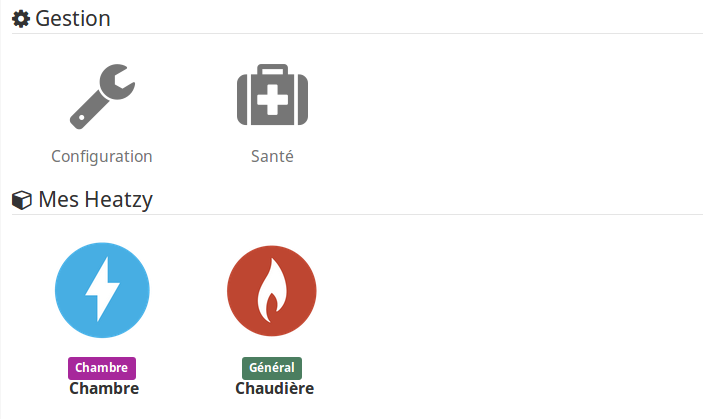
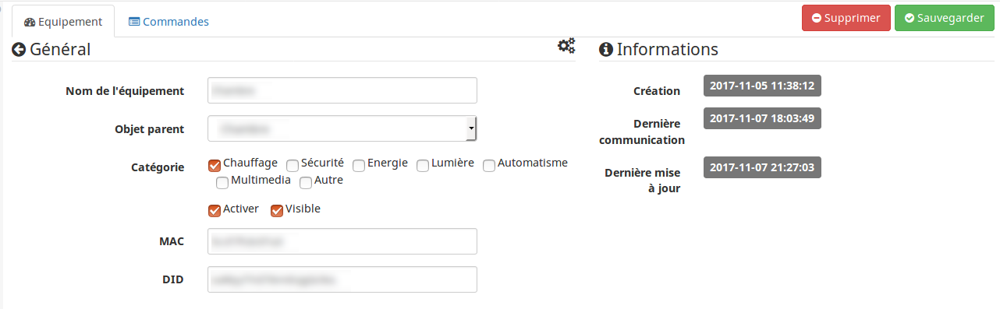

Heatzy
====

Description
=== 
Ce plugin permet de gérer vos modules pilote et flam de la marque Heatzy.

Pré-requis
=== 
L'utilisation de ce plugin requiert de créer un compte avec l'application Heatzy disponible sur Android et iOS.

Il est nécessaire de suivre le guide d'installation et d'utilisation fourni pour mettre en service les modules Heatzy.

Configuration
==

Configuration du plugin
-------------
Après téléchargement du plugin, il vous suffit juste d'activer celui-ci et de saisir l'adresse mail et le mot de passe pour accéder au cloud Heatzy.

Puis cliquez sur synchroniser pour récupérer la liste des modules Heatzy pilotes associés à votre compte.

* **Email** : votre adresse email utilisé lors de votre enregistrement dans le cloud
* **Mot de passe** : votre mot de passe d'accès renseigné lors de votre enregistrement dans le cloud
* **Token** : votre token d'accès au cloud, après la synchronisation de vos modules
* **Expire** : la date d'expiration du token d'accès au cloud, après la synchronisation de vos modules
* **Synchroniser** : permet de synchroniser vos modules Heatzy avec le cloud

Configuration des objets connectés Heatzy
-------------
La configuration des modules Heatzy est accessible à partir du menu 'Plugins' > 'Objets connectés'.

Une fois que vous cliquez sur un équipement vous retrouvez la configuration de l'équipement :

Vous retrouvez dans la section **Général**

* **Nom de l'équipement** : nom de votre module Heatzy, permet de renommer le module dans le cloud.
* **Objet parent** : objet parent auquel appartient votre équipement
* **Catégorie** : catégorie de l'équipement, par défaut chauffage
* **Activer** : permet de rendre votre équipement actif
* **Visible** : le rend visible sur le dashboard
* **MAC** : l'adresse MAC du module Heatzy
* **DID** : l'identifiant du module Heatzy

Vous retrouvez dans la section **Informations**

* **Création** : date et heure de création de l'équipement
* **Dernière communication** : date et heure de la dernière communication du module Heatzy dans le cloud
* **Dernière mise à jour** : date et heure de mise à jour de l'équipement
* *Type** : pilote ou flam

Configuration des commandes des objets connectés Heatzy
-------------

### Wigdet dashboard pilote

### Wigdet dashboard flam

### Wigdet mobile

Chaque équipement dispose des commandes actions :

* **Off** : permet de passer en mode off
* **Confort** : permet de passer en mode confort
* **Eco** : permet de passer en mode eco
* **HorsGel** : permet de passer en mode hors-gel
* refresh : permet forcer le rafraichissement de l'etat de l'équipement
* **Activer Programmation** : permet d'activer la programmation, pré-définie par l'application Heatzy
* **Désactiver Programmation** : permet d'activer la programmation, pré-définie par l'application Heatzy
* **Plugzy OFF** : Permet d'éteindre le plugzy *(seulement pour l'équipement de type flam)*
* **Plugzy ON** : Permet d'allumer le plugzy *(seulement pour l'équipement de type flam)*

D'une commande **Etat** de type _numerique_ :

* **0** : Mode Confort
* **1** : Mode Eco
* **2** : Mode Hors-gel
* **3** : Mode Off

Et d'une commande **Mode** de type _string_ :

* **Confort**
* **Eco**
* **HorsGel**
* **Off**

Et d'une commande **Etat programmation** de type _binaire_ :

* **1** : La programmation est activée
* **0**: La programmation est désactivée

L'équipement de type flam dispose des commandes de type _numerique_ :

* **Temp. confort** : la température de consigne du mode confort
* **Temp. eco**  : la température de consigne du mode eco
* **Temperature** : la température relevé par plugzy

>Vous pouvez tester la valeur de la commande info *Etat* ou *Mode* dans vos scénarios.

FAQ
=== 

**Quelle est la fréquence de rafraîchissement ?**

Le système récupère l'état du module Heatzy toutes les minutes. L'état de la programmation est rafraîchie toutes les 30 minutes.

>Il est possible de désactiver le rafraîchissement de l'état de la programmation en décochant la fonctionnalités **con30** depuis la page de configuration du plugin.

**Lorsque je désactive la programmation, l'état n'est pas mis à jour ?**

Le plugin met à jour les 336 tâches associées au module Heatzy pour les désactiver/activer, soit 336 requêtes HTTP envoyé au cloud Heatzy. Il est donc nécessaire d'attendre quelques secondes que le plugin finisse d'activer/désactiver chacune des tâches. L’état de la programmation est mis à jour si tous ce passe bien.

**Quelle est la durée de vie du token utilisateur d'accès au cloud ?**

Le token d'accès au cloud change à chaque synchronisation. Un nouveau token est demandé au cloud automatiquement 24h avant que celui-ci expire.

**Mon équipement n'est pas rafraîchi ?**

Vérifiez si l'équipement est bien activé.

